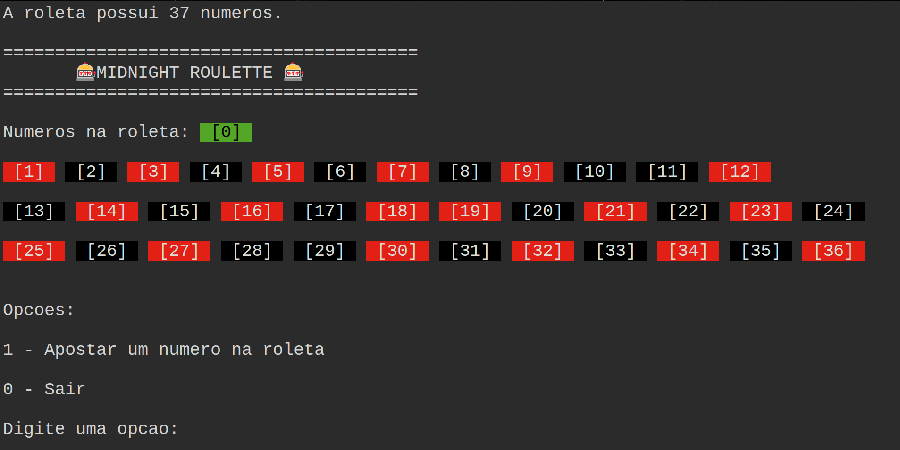
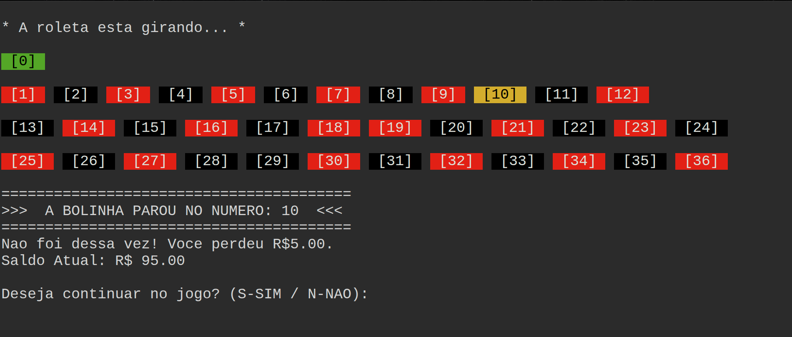

# 🎰🕛 Midnight Roulette / Roleta da Meia Noite

Bem-vindo à **Roleta da Meia Noite**, um jogo de cassino interativo desenvolvido em terminal utilizando a linguagem **C++**. 

O projeto foi construído como um exercício acadêmico para aplicar conceitos práticos de **Estruturas de Dados** (focando em listas dinâmicas lineares) e **Modularização de Código**.

---

## 📸 Demonstração

### Tela Inicial

### Giro da Roleta

---

## 🛠️ Funcionalidades do Jogo

* **Sistema de Carteira (Saldo):** O jogador inicia com um saldo de **R$ 100,00** para fazer suas apostas.
* **Validação de Entrada:** O sistema impede apostas com valores negativos, valores maiores do que o saldo atual da carteira ou números fora do escopo da roleta (0 a 36).
* **Multiplicador de Cassino Real:** Acertar o número exato na roleta paga uma recompensa de **35 vezes** o valor apostado.
* **Condição de Falência:** Se o saldo do jogador chegar a R$ 0,00, o jogo encerra automaticamente.
* **Menu Dinâmico:** Permite visualizar os números da roleta, fazer novas apostas ou sair salvando o lucro atual.

---

## 🧠 Estrutura de Dados & Conceitos Utilizados

### 1. Lista Encadeada Circular Dinâmica
A roleta foi modelada utilizando uma **Lista Circular Encadeada**. Cada número da roleta (de 0 a 36) representa um nó (`struct no`) alocado dinamicamente na memória. O último nó inserido aponta de volta para o primeiro nó, simulando perfeitamente o comportamento físico de uma roleta girando continuamente.

### 2. Passagem de Parâmetros por Referência (Ponteiros)
Para evitar o uso de variáveis globais (má prática de programação), o saldo da carteira do jogador é controlado diretamente da `main` e alterado dentro da função de giro passando o seu endereço de memória via ponteiro (`float *carteira`).

### 3. Modularização de Código
O projeto foi dividido em três arquivos para manter a organização e legibilidade do código-fonte:
* `roleta.h`: Declaração da estrutura do nó e protótipos das funções (Header file).
* `roleta.cpp`: Implementação da lógica das funções (Inicialização, Listagem e Giro).
* `main.cpp`: Controle do fluxo do jogo, interações de entrada/saída e o menu principal.

## 🎰 Como Jogar

Você pode curtir a Roleta da Meia Noite de duas formas: direto pelo navegador ou compilando o código na sua própria máquina.

### Opção 1: Jogar Direto pelo Navegador (Sem Instalar Nada)
O jogo está hospedado nas nuvens e envelopado em um terminal web via Docker.
* **Link de Acesso:** [https://midnight-roulette.onrender.com](https://midnight-roulette.onrender.com)

> ⚠️ **Nota do Servidor:** Como o jogo está em um servidor gratuito, se o link ficar sem acessos por mais de 15 minutos ele entra em "modo de espera". Ao clicar no link, **pode levar cerca de 1 minuto para a página carregar** enquanto o servidor "acorda". Se travar, basta atualizar a página (F5)!

### Opção 2: Rodar Localmente (Via Terminal Linux / macOS / Windows)
Se você preferir baixar os arquivos e compilar no seu computador, garanta que possui o compilador `g++` instalado e siga os passos abaixo:

1. **Clone o repositório:**

       git clone [https://github.com/TamiresMusafir/midnight-roulette.git](https://github.com/TamiresMusafir/midnight-roulette.git)
       cd midnight-roulette
       g++ main.cpp roleta.cpp -o roleta_jogo
       ./roleta_jogo
---

## 📁 Estrutura do Repositório

       ├── main.cpp     # Fluxo principal e menus do jogo
       ├── roleta.cpp   # Corpo das funções e lógica de giro da roleta
       └── roleta.h     # Declaração da struct e das assinaturas de função
       ├── Dockerfile        # Configuração do container
       ├── README.md
       └── images
           ├── ex.png        # Tela principal
           └── ex2.png       # Exemplo de jogada

---

## 👤 Autor

* **Tamires Musafir** - [Github](https://github.com/TamiresMusafir)

---

Obrigada pelo interesse e bom jogo! 🎰🎲
